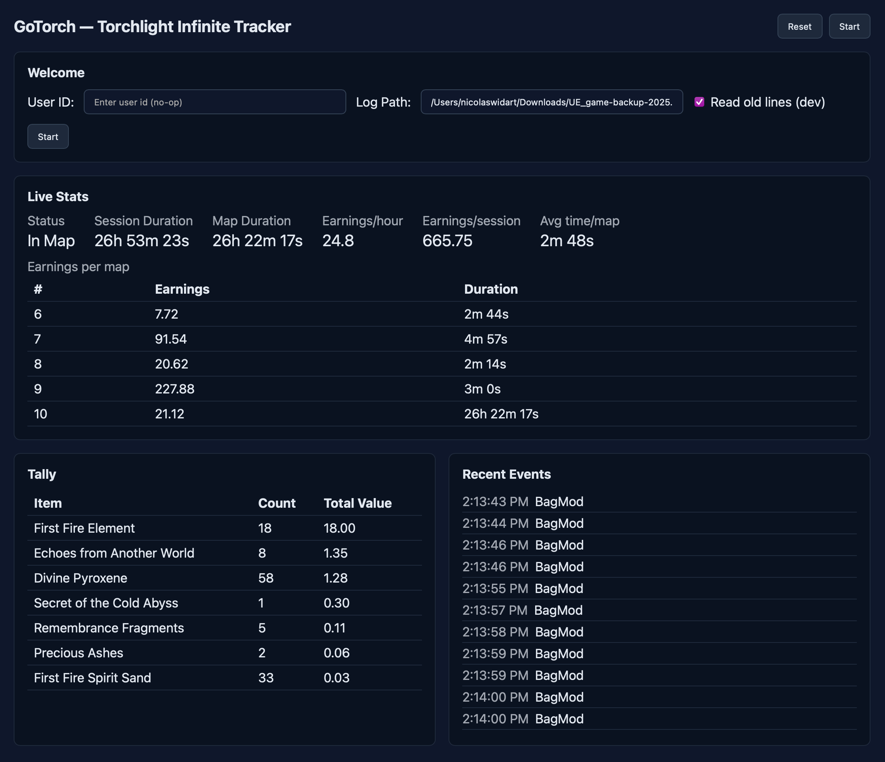

# GoTorch — Torchlight Infinite Tracker

GoTorch is a desktop app that monitors Torchlight Infinite's `UE_game.log`, detects map runs, and tallies item drops during each run.

Download the latest release via the Actions tab. (_will be improved via Releases once stabilized_)

## Setup

### 1. In **Torchlite**: Escape > **"Enable Log"**

### 2. In **GoTorch**: Select the log file in the GoTorch application.

For example standalone: `C:\Users\USERNAME\AppData\Local\Torchlite\UE_game.log`

_Tip: if you click start and the log file input is empty you will be prompted to select the log file via a file browser._

### 3. Click **Start**

## License

MIT (see your repository choice).
